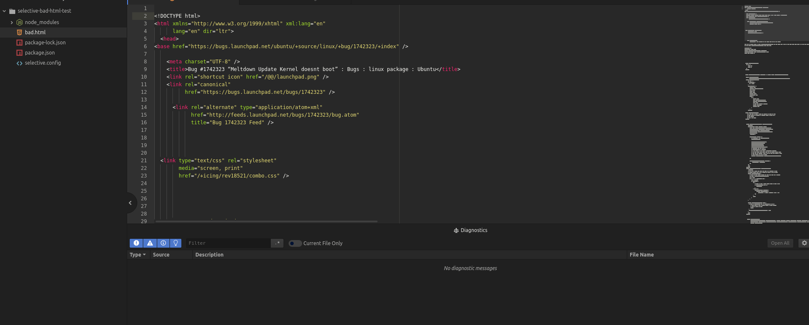

# Selective Atom Plugin

[](https://travis-ci.org/ChristianMurphy/selective)

> Use CSS selectors to find HTML anti-patterns

```bash
apm install linter-selective
```



## Creating Rules

create a configuration in a _.selective_ file.

`@selective/rehype` will look for a _config.selective_ file in the current folder by default.

The rules language is designed to work similar to CSS.
Use a [CSS Selector](https://developer.mozilla.org/en-US/docs/Web/CSS/CSS_Selectors) to find HTML elements.

Instead of the usual style rules, linter rules are used.

* `name` a unique identifier for easily tracking down the rule
* `description` an explanation of the problem.
* `recommended` how this will be reported, can be one of:
  * `error` will stop processing and return an error code
  * `warn` will continue processing, but highlight as important, no error code.
  * `info` will continue processing, no error code.
  * `off` disabled

## Example Rules

```css
img:not([alt]) {
  name: "img-alt";
  description: "image tag must contain an alt property";
  recommended: warn;
}

img:not([src]) {
  name: "img-src";
  description: "image tag must contain an src property";
  recommended: warn;
}

ol > :not(li),
ul > :not(li),
:not(ol) > li,
:not(ul) > li {
  name: "list-item";
  description: "unorder lists, ordered lists, and list items must have a direction relationship";
  recommended: warn;
}
```

## References

* [Atom Linter](https://atom.io/packages/linter)
* [Rehype][https://github.com/rehypejs/rehype]
* [CSS Selectors][https://developer.mozilla.org/en-us/docs/web/css/css_selectors]
