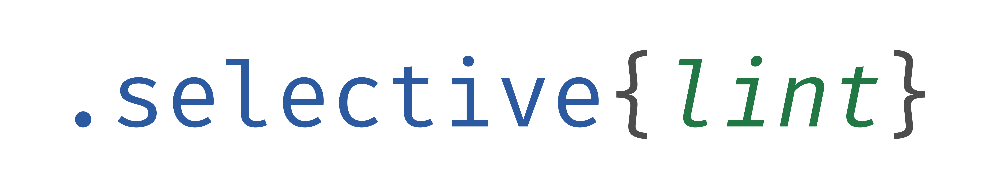

# 

[](https://www.npmjs.com/package/@selective/lint)
[](https://travis-ci.org/ChristianMurphy/selective)
[](https://ci.appveyor.com/project/ChristianMurphy/selective/branch/master)

> Creates a [Rehype][] plugin from JSON rules to check for HTML anti patterns and reports issues back as [vFile][] messages

## Installation

```shell
# npm
npm install @selective/lint

# yarn
yarn add @selective/lint
```

## Usage

<!-- eslint-disable no-console -->

```javascript
const rehype = require("rehype");
const lint = require("@selective/lint");
const { readFileSync } = require("fs");

rehype()
  .use(lint, [
    {
      name: "img-alt",
      description: "image tag must contain an alt property",
      recommended: "warn",
      selector: "img:not([alt])"
    }
  ])
  .process(readFileSync("somefile.html"), err => {
    console.error(err);
  });
```

## References

* [Rehype][]
* [Unified Plugin API][]
* [vFile][]

[rehype]: https://github.com/rehypejs/rehype
[unified plugin api]: https://unifiedjs.github.io/create-a-plugin.html
[vfile]: https://github.com/vfile/vfile
