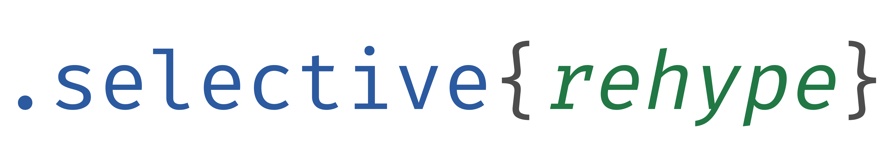

# 

[](https://www.npmjs.com/package/@selective/rehype)
[](https://travis-ci.org/ChristianMurphy/selective)
[](https://ci.appveyor.com/project/ChristianMurphy/selective/branch/master)

> Use [CSS Selectors][] to describe anti-patterns in HTML

## Installation

```shell
# npm
npm install @selective/rehype

# yarn
yarn add @selective/rehype
```

## Creating Rules

create a configuration in a _.selective_ file.

`@selective/rehype` will look for a _config.selective_ file in the current folder by default.

The rules language is designed to work similar to CSS.
Use a [CSS Selector](https://developer.mozilla.org/en-US/docs/Web/CSS/CSS_Selectors) to find HTML elements.

Instead of the usual style rules, linter rules are used.

* `name` a unique identifier for easily tracking down the rule
* `description` an explanation of the problem.
* `recommended` how this will be reported, can be one of:
  * `error` will stop processing and return an error code
  * `warn` will continue processing, but highlight as important, no error code.
  * `info` will continue processing, no error code.
  * `off` disabled

## Example Rules

```css
img:not([alt]) {
  name: "img-alt";
  description: "image tag must contain an alt property";
  recommended: warn;
}

img:not([src]) {
  name: "img-src";
  description: "image tag must contain an src property";
  recommended: warn;
}

ol > :not(li),
ul > :not(li),
:not(ol) > li,
:not(ul) > li {
  name: "list-item";
  description: "unorder lists, ordered lists, and list items must have a direction relationship";
  recommended: warn;
}
```

## Rehype CLI Usage

in _package.json_ through [rehype][].

```json
{
  "devDependencies": {
    "rehype": "^5.0.0",
    "@selective/rehype": "0.0.3"
  },
  "rehype": {
    "plugins": ["@selective/rehype"]
  }
}
```

this can be additionally customized with a custom config file path

```json
{
  "devDependencies": {
    "rehype": "^5.0.0",
    "@selective/rehype": "0.0.3"
  },
  "rehype": {
    "plugins": [["@selective/rehype", { "config": "custom.selective" }]]
  }
}
```

## Programmatic Usage

<!-- eslint-disable no-console -->

```javascript
const rehype = require("rehype");
const selectiveRehype = require("@selective/rehype");
const { readFileSync } = require("fs");

rehype()
  .use(selectiveRehype, {
    config: "config.selective"
  })
  .process(readFileSync("somefile.html"), err => {
    console.error(err);
  });
```

## References

* [Rehype][]
* [CSS Selectors][]

[css selectors]: https://developer.mozilla.org/en-US/docs/Web/CSS/CSS_Selectors
[rehype]: https://github.com/rehypejs/rehype
